# Voice Pilot

Hands-free voice control for web-based NSPIRE inspection apps. Built and tested against
HACSM NSPIRE Practice (a training app). Reviewers: start with REVIEW.md.

## Videos
- [How Voice Pilot works (1:20)](docs/videos/voice-pilot-how-it-works.mp4) · [captions](docs/videos/voice-pilot-how-it-works.srt)
- [How to set up voice (0:54)](docs/videos/voice-pilot-how-to-set-up.mp4) · [captions](docs/videos/voice-pilot-how-to-set-up.srt)
- [Walkthrough Clip device concept, with exploded view (0:44)](docs/videos/walkthrough-clip-device-concept.mp4)

## Screenshots

**Voice Pilot in the app (real footage)**

| Several findings in one breath | Life-threatening read back |
|---|---|
| 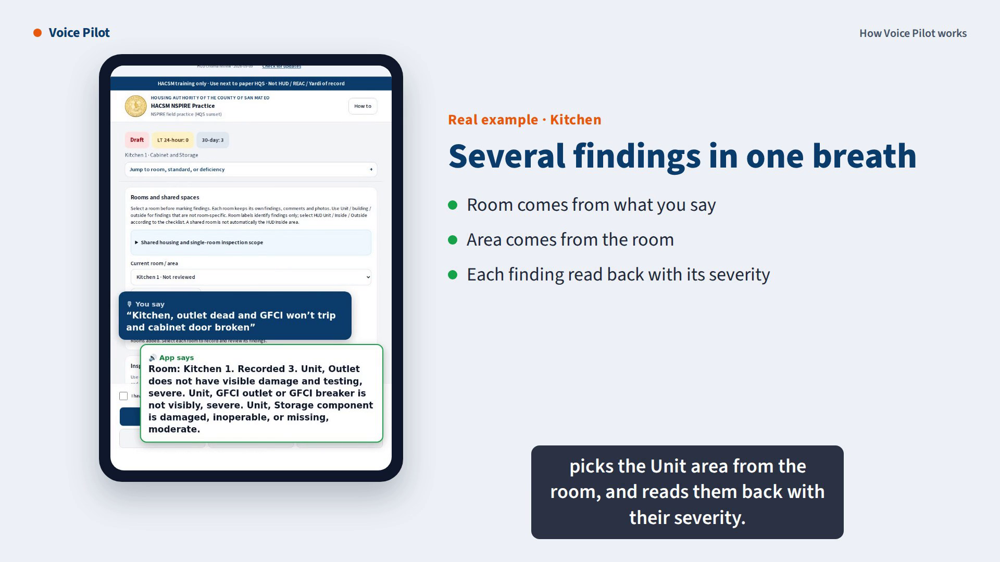 | 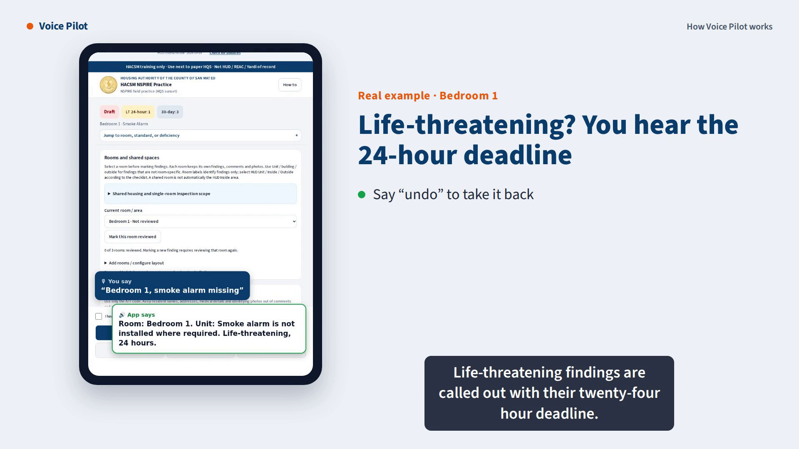 |

**How it decides**

| From words to a recorded finding | Not sure? Jev, then you |
|---|---|
| 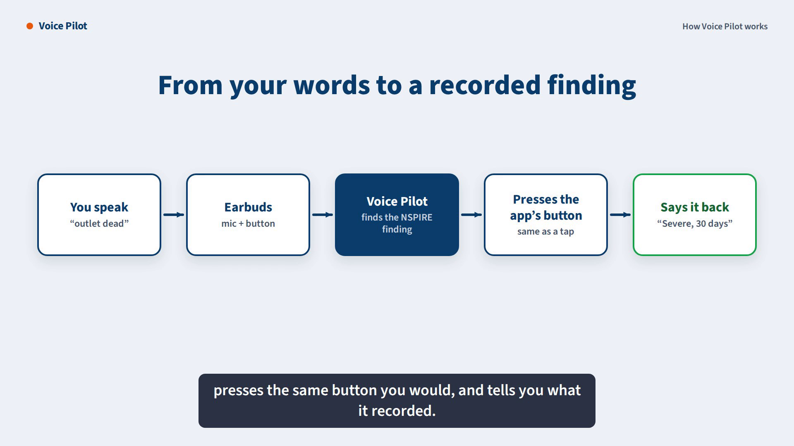 | 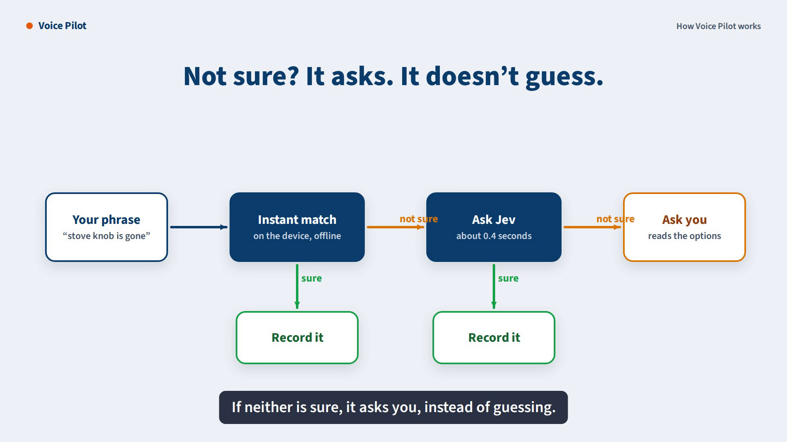 |
| **HQS wording to NSPIRE** | **Learning loop** |
| 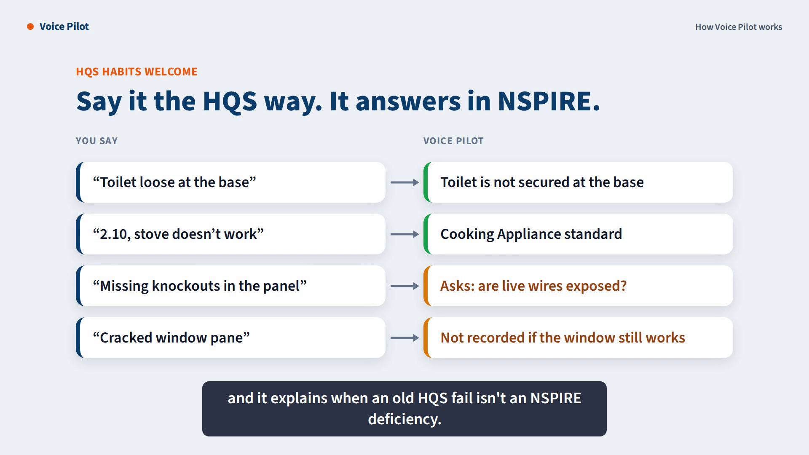 | 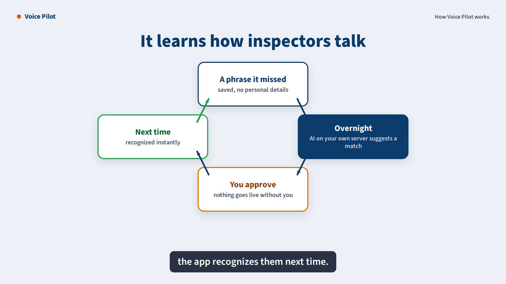 |

**First-time setup**

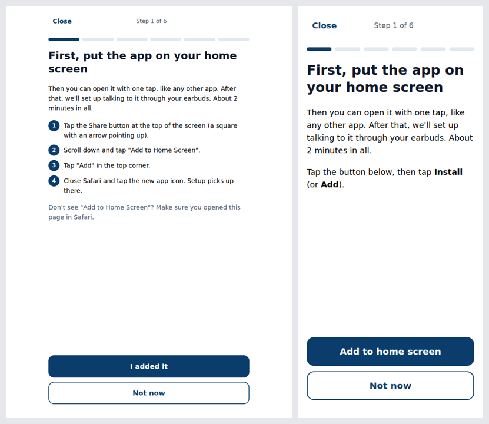
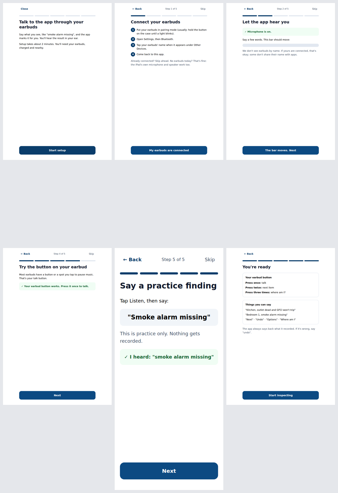

**Walkthrough Clip device (design concept, not yet built)**

| Clip and pocket hub | Logging a finding |
|---|---|
| 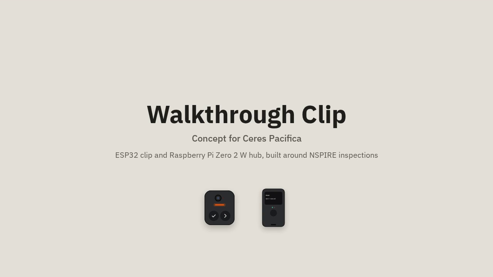 | 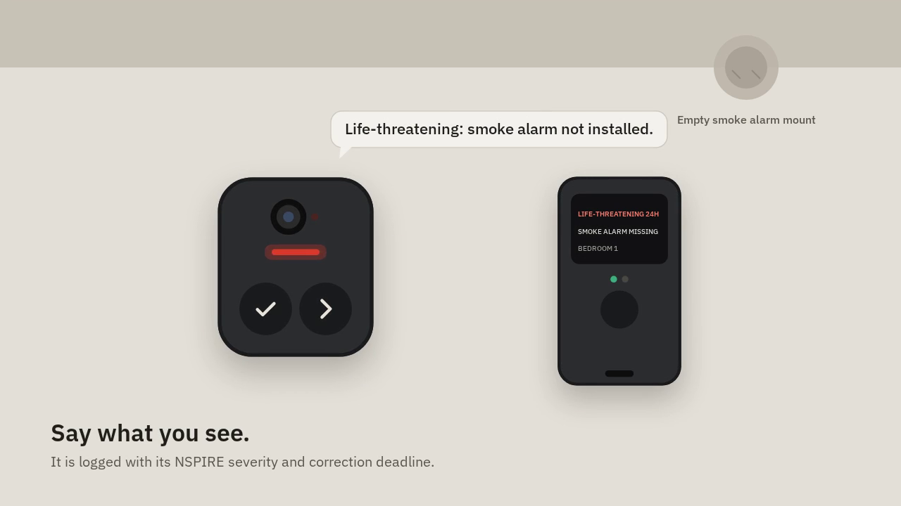 |
| **Photo with camera-on light** | **Offline, then sync** |
| 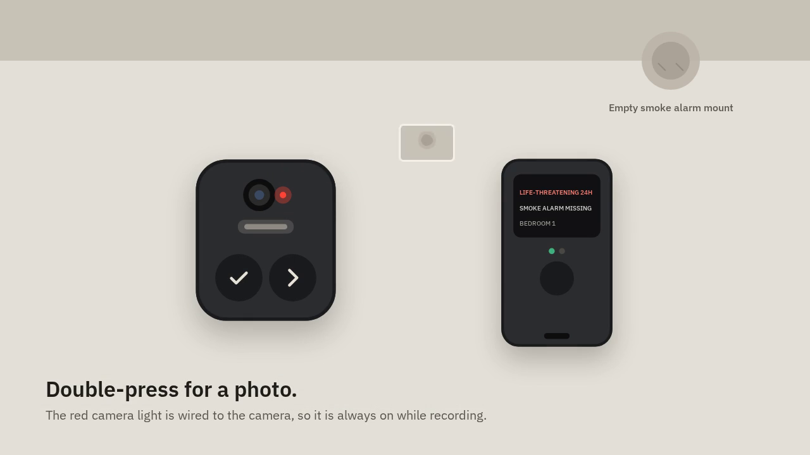 | 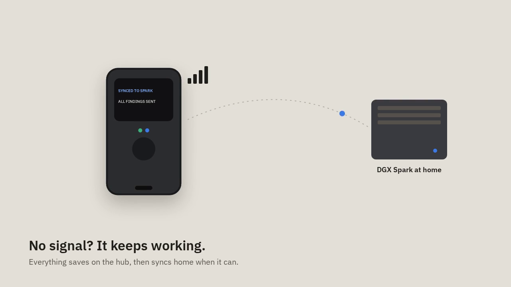 |

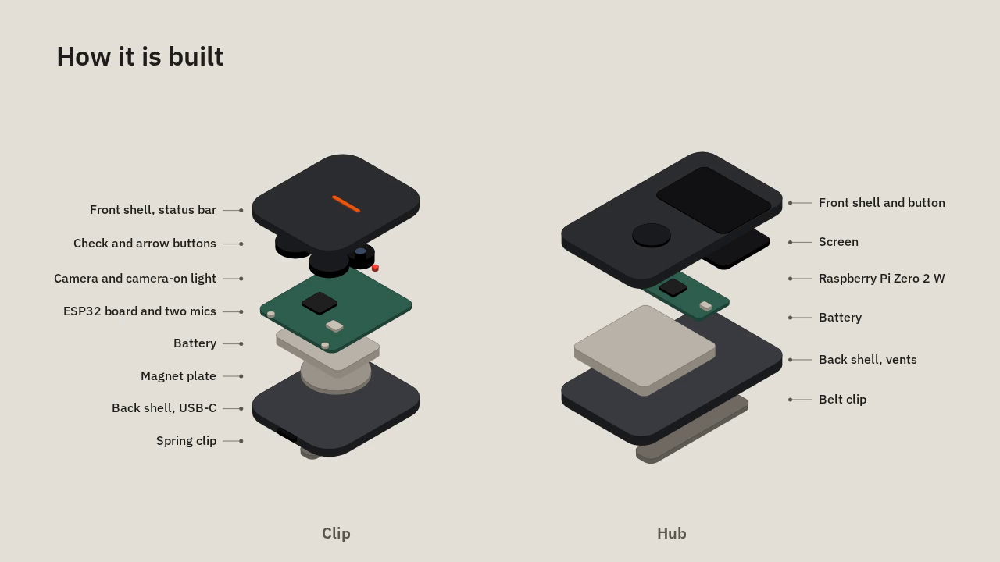

## Voice Pilot for HACSM NSPIRE Practice

Bluetooth headset and voice control for the inspection screen. A small local matcher
(no AI service) maps what you say to the 63 standards and the deficiency buttons on
screen, then presses those buttons for you.

## Try it today, no code changes (bookmarklet)
1. In Chrome on the phone (or Safari on the iPad), bookmark any page.
2. Edit the bookmark: name it `Headset`, and replace its address with everything in bookmarklet.txt.
3. Open the app in the browser tab (not the home-screen icon), start an inspection,
   then type `Headset` in the address bar and pick the bookmark. Two buttons appear on the right.
4. Pair your earbuds, tap "Headset off" to turn it on, then press the earbud button and talk.

## First-time setup for inspectors (VoiceSetup.tsx)
The first time someone opens an inspection, they see one button: "Set up voice". It walks them
through six short screens, one thing at a time, with large buttons and plain words:
0. Put the app on your home screen (always first): Android gets a real "Add to home screen"
   button when Chrome offers one; iPad gets Share > Add to Home Screen steps; already opened from
   the icon shows a checkmark. On iPad, home-screen apps keep their own storage, so setup simply
   continues when the inspector opens the new icon.
1. Connect your earbuds (iPad or Android steps, picked automatically)
2. Let the app hear you (microphone permission, with a moving level bar to prove it works)
3. Check you can hear the app (plays a short message in the earbuds)
4. Try the button on your earbud (if the earbuds don't send their button, a big green Talk
   button appears on screen instead; nobody gets stuck)
5. Say a practice finding ("smoke alarm missing"; nothing is recorded)
Every step checks itself and explains the fix in plain words if something fails (microphone
blocked, no sound, no internet for voice). Any step can be skipped. Results are saved on the
device; "Voice help" reruns setup any time.

Known iPad limit: Apple has not always allowed voice recognition in home-screen web apps. The
setup's practice step detects this and tells the inspector to use the on-screen buttons and tell a
supervisor. Test on your iPads before rollout.

## Add it to the app for good (Next.js)
Copy voicePilot.ts, clipSpeaker.ts, hqsCrosswalk.ts, VoiceSetup.tsx and VoicePilotButton.tsx into the project and render
`<VoicePilotButton />` in the inspection page or root layout. It only shows on screens
that have the standard selector. For long-term stability, add `data-voice` attributes
to the Next/Prev buttons and finding buttons so wording changes can't break matching.

## Jev for hard phrases (optional)
When the local matcher can't settle a phrase ("black stuff growing on the bathroom ceiling",
"the stove knob is gone"), the pilot asks Jev, TypeSafe's decision model, through your own
server route, about 0.3 to 1 second. Jev only acts when it's clearly sure; otherwise it offers
the top two options. Offline or slow, the pilot falls back to local matching.
1. Copy server/route.ts to app/api/jev/route.ts.
2. In Vercel, add the environment variable TYPESAFE_API_KEY. Never put the key in browser code.
3. Render `<VoicePilotButton jev />`.
Only the spoken phrase, the room label and the standard name are sent; the app's rule against
resident details applies to what you say, too.

## Kokoro voice (optional)
Replies play in a natural Kokoro voice from pre-made clips: instant and offline. Anything without
a clip (an unknown room name, a quoted phrase) uses the browser voice for that whole reply.
1. Run Kokoro Web on the DGX Spark (arm64 image):
   docker run -d --name kokoro -p 3000:3000 -e KW_SECRET_API_KEY=pick-a-secret -v ~/kokoro-cache:/kokoro/cache --restart unless-stopped ghcr.io/eduardolat/kokoro-web:latest
2. python tools/export_phrases.py --out tools/phrases.json   (re-run when the app's standards change)
3. KOKORO_KEY=pick-a-secret python tools/make_voice_clips.py --api http://spark:3000/api/v1 --phrases tools/phrases.json --out public/voice --voice af_heart
4. Commit public/voice (about 568 clips) and add /voice/ to the service worker's cached paths so it works offline.
Try voices at voice-generator.pages.dev first; re-running with another --voice only remakes clips.

## HQS habits -> NSPIRE (hqsCrosswalk.ts)
Inspectors trained on HQS can keep talking the way they're used to:
- HQS item numbers and names from form HUD-52580 ("2.10 stove doesn't work", "3.13 ventilation",
  "8.4 garbage and debris") go to the NSPIRE standard that now covers them.
- HQS-era fail wording from PHA "most common fail" lists ("missing knockouts", "burner knob",
  "no TPR discharge line", "toilet loose at the base", "outlet cover plate") is understood.
- Where severity depends on something the phrase doesn't say (cover plates, knockouts, space
  heaters, double taps) the pilot explains and reads the options instead of recording.
- HQS conditions that aren't NSPIRE deficiencies (a cracked pane that still works, site and
  neighborhood, no window in a bedroom, screens) get an explanation, not a finding.
- Heating options tied to an inspection-date window are only offered in the right season.
Check the retired items with your trainer; they come from published comparisons, not a HUD crosswalk.

## Learning loop (background)
1. On the device: when the pilot can't place a phrase, it's ambiguous, Jev decides, or the inspector
   picks an option after a miss, the phrase is logged (no names; long numbers and emails removed).
2. Sync: `<VoicePilotButton />` sends new events to /api/learn every few minutes, when the
   connection returns, and when headset mode turns off. Copy server/learn-route.ts to
   app/api/learn/route.ts and set LEARN_SINK_URL and LEARN_SECRET in Vercel.
3. On the DGX Spark: tools/learn_receiver.py stores events as daily files (expose it with a
   Cloudflare Tunnel or Tailscale Funnel).
4. Nightly: tools/label_misses.py asks an AI model (a local model on the Spark, or any
   OpenAI-compatible endpoint) to suggest standard + deficiency for each unresolved phrase, and
   appends them to review.csv with Jev's choice beside the AI's.
5. You review: mark approve = y (fix the suggestion first if needed).
6. tools/build_learned.py writes learned.json; deploy it to the app's public/ folder. The pilot
   then matches those phrases instantly and offline, and passes them to Jev as examples of how
   inspectors talk. Field corrections count on their own unless you pass --corrections-need-review.
Default labeler model: GLM-5.3 on the Spark, with reasoning skipped (add --reason to turn it on) (vllm serve zai-org/GLM-5.3-FP8 --served-model-name glm-5.3 --port 8000).
Example cron on the Spark:  0 2 * * *  cd voice_pilot/tools && python label_misses.py --events data/learn --catalog catalog.json --out review.csv

## Controls
Headset: 1 press talk · 2 presses next standard · 3 presses where am I · skip buttons next/previous.

Say:
- a room, then findings, in one breath: "kitchen outlet dead and gfci doesn't trip and cabinet door broken"
  (several findings are recorded and read back together; "and", "also", "plus" or simply naming the next item splits them)
- a finding: "smoke alarm missing", "gfci doesn't trip", "window won't lock", "lots of roaches"
- the area when asked: "unit", "inside", "outside"

Auto-area: in a private room (bedroom, kitchen, bathroom, rented room, hallway) findings go to Unit,
and in clearly exterior rooms (front yard, porch, parking, roof) they go to Outside. In shared or
common rooms, and on "Unit / building / outside", it still asks, because HUD's Inside area depends
on the property. Saying an area always wins. Turn it off with `pilot.autoArea = false`.

"Only 1 toilet / tub" vs "another one elsewhere" is decided from the bathrooms on file: one bathroom
room means "only 1"; more than one means "elsewhere". Undo walks back one finding at a time, returning
to the room it was recorded in.
- next, previous, go to water heater, where am I, options, number 2, undo
- comment battery removed by tenant

The app's own rule still applies: no resident names, addresses, or medical details in comments.

## Test
python live_test.py  (14 single-finding scenarios against the live site)
python live_test_rooms_and_batches.py  (15 scenarios: rooms, auto-area, multi-finding, undo)
python tools/hqs_phrases_test.py  (17 HQS-era phrases)
python tools/setup_walkthrough_test.py and tools/setup_help_messages_test.py  (setup screens; need the harness, see file)
python tools/setup_home_screen_test.py  (home screen step: iPad Safari, iPad icon, Android button, Android menu)
python tools/learning_loop_test.py  (device log -> sync -> receiver -> AI labeling -> review -> learned phrases)
